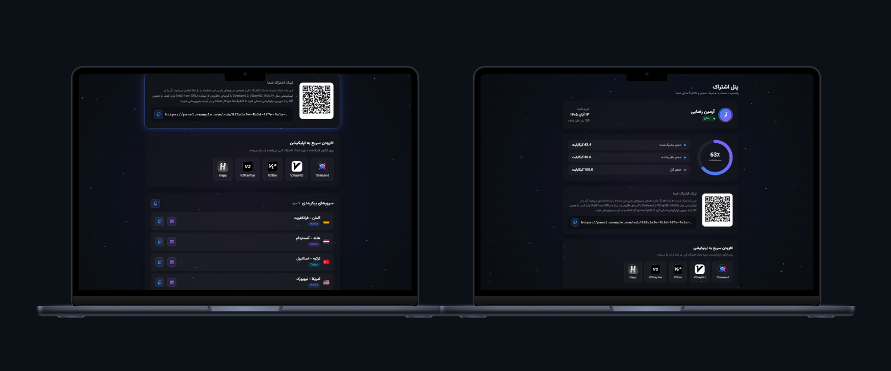
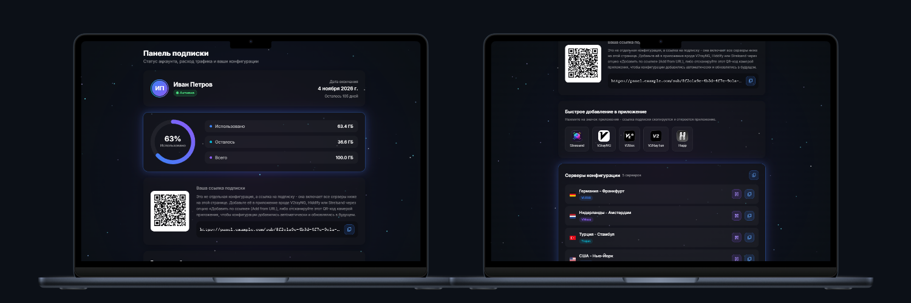

::: {align="center"}
# 🌌 Orbit Sub

**قالب مدرن صفحه اشتراک برای مرزبان و پاسارگاد**\
**Modern Glassmorphism Subscription Template for Marzban & Pasargad**

🇮🇷 **[فارسی](#-فارسی)** • 🇺🇸 **[English](#-english)**
:::

------------------------------------------------------------------------

## 📸 Preview

  فارسی                           Russian
  ------------------------------- -------------------------------
     

------------------------------------------------------------------------

## 🇮🇷 فارسی


### ویژگی‌ها (Features)

-   **طراحی شیشه‌ای (Glassmorphism):** کارت‌های نیمه‌شفاف با بلور پس‌زمینه و
    درخشش آبی/بنفش هنگام هاور
-   **پس‌زمینه‌ی کهکشانی متحرک:** میدون ستاره‌ای با عمق و چشمک‌زدن، پیاده‌شده
    با Canvas (بدون وابستگی به WebGL سنگین)
-   **وضعیت زنده‌ی کاربر:** نام، وضعیت فعال/غیرفعال با نشانگر پالس، تاریخ
    انقضا (یا نامحدود)
-   **نمودار مصرف حجم:** حلقه‌ی دایره‌ای انیمیشن‌دار برای
    مصرف‌شده/باقی‌مانده/کل (پشتیبانی کامل از حالت نامحدود)
-   **لینک اشتراک + QR:** با توضیح داخل صفحه که کاربر دقیقاً بدونه باهاش
    چیکار کنه
-   **افزودن سریع به اپلیکیشن:** دکمه‌ی مخصوص هرکدوم از Streisand،
    V2rayNG، V2Box، V2RayTun و Happ با deep link واقعی هر اپ + کپی
    خودکار لینک
-   **لیست کانفیگ‌ها:** پرچم کشور (خودکار یا حدسی از remark)، کپی تکی و
    کپی همه با یه دکمه، QR جداگانه برای هر سرور، اسکرول با گرادیانت محو
    برای لیست‌های بلند
-   **یکپارچگی مستقیم با مرزبان:** بدون نیاز به API جدا؛ داده از طریق
    همون موتور Jinja2 خود مرزبان تزریق می‌شه
-   **دسترس‌پذیری:** فوکوس کیبورد، `aria-label` روی همه‌ی دکمه‌ها، پشتیبانی
    از `prefers-reduced-motion`

### نصب دستی (Manual Install)

این پروژه به‌عنوان **تمپلیت صفحه‌ی اشتراک** روی سرور مرزبان (یا پاسارگاد)
نصب می‌شه - نیازی به build گرفتن دستی نیست، فایل آماده رو مستقیم از بخش
[Releases](../../releases) این ریپو دانلود کن.

#### روی مرزبان

``` bash
# ۱. فایل نسخه‌ی فارسی رو از آخرین Release دانلود کن
sudo mkdir -p /var/lib/marzban/templates/subscription
sudo wget -O /var/lib/marzban/templates/subscription/index.html \
  https://github.com/1amirhoseiin1/orbit-sub/releases/latest/download/index-fa.html

# ۲. این دو متغیر رو به .env مرزبان اضافه کن (اگه قبلاً نبود)
echo 'CUSTOM_TEMPLATES_DIRECTORY="/var/lib/marzban/templates/"' | sudo tee -a /opt/marzban/.env
echo 'SUBSCRIPTION_PAGE_TEMPLATE="subscription/index.html"' | sudo tee -a /opt/marzban/.env

# ۳. مرزبان رو ری‌استارت کن
marzban restart
```

#### روی پاسارگاد

پاسارگاد یه فورک از مرزبانه و مسیرها و مکانیزم تمپلیت
(`CUSTOM_TEMPLATES_DIRECTORY`، `SUBSCRIPTION_PAGE_TEMPLATE` و مسیر
`.env`) دقیقاً همون مرزبانه - یعنی همون سه دستور بالا رو بدون هیچ تغییری
روی پاسارگاد هم اجرا کن.

### توسعه‌ی لوکال

برای build گرفتن دستی یا تغییر دادن کد، وارد پوشه‌ی `fa/` بشو و
دستورالعمل کامل (`npm install`، `npm run dev`، `npm run build`) رو تو
[`fa/README.md`](./fa/README.md) ببین.

------------------------------------------------------------------------

------------------------------------------------------------------------

## 🇺🇸 English


### Features

-   **Glassmorphism UI:** translucent cards with backdrop blur and a
    blue/violet glow on hover
-   **Animated galaxy background:** a depth-aware, twinkling starfield
    rendered on Canvas (no heavy WebGL dependency)
-   **Live user status:** name, active/inactive with a pulse indicator,
    expiry date (or unlimited)
-   **Usage chart:** animated circular ring for used/remaining/total
    data (fully supports unlimited plans)
-   **Subscription link + QR:** with inline copy explaining what it is
    and how to use it
-   **Quick-add to app:** one-tap buttons for Streisand, V2rayNG, V2Box,
    V2RayTun, and Happ using each app's real deep link scheme, plus
    automatic clipboard copy as a fallback
-   **Config list:** country flags (auto-detected or guessed from the
    remark), single and bulk copy, per-server QR code, scrollable with a
    fade gradient for long lists
-   **Direct Marzban integration:** no separate API needed - data is
    injected through Marzban's own Jinja2 templating engine
-   **Accessibility:** full keyboard focus support, `aria-label` on
    every button, respects `prefers-reduced-motion`

### Manual Install

This project is installed as a **subscription page template** on your
Marzban (or Pasargad) server - no manual build required, just grab the
ready-made file from this repo's [Releases](../../releases) page.

#### On Marzban

``` bash
# 1. Download the English/Russian build from the latest release
sudo mkdir -p /var/lib/marzban/templates/subscription
sudo wget -O /var/lib/marzban/templates/subscription/index.html \
  https://github.com/1amirhoseiin1/orbit-sub/releases/latest/download/index-ru.html

# 2. Add these two variables to Marzban's .env (if not already present)
echo 'CUSTOM_TEMPLATES_DIRECTORY="/var/lib/marzban/templates/"' | sudo tee -a /opt/marzban/.env
echo 'SUBSCRIPTION_PAGE_TEMPLATE="subscription/index.html"' | sudo tee -a /opt/marzban/.env

# 3. Restart Marzban
marzban restart
```

#### On Pasargad

Pasargad is a fork of Marzban, and the template mechanism and paths
(`CUSTOM_TEMPLATES_DIRECTORY`, `SUBSCRIPTION_PAGE_TEMPLATE`, and the
`.env` location) are exactly the same as Marzban's - just run the same
three commands above on Pasargad with no changes.

### Local development

To build manually or modify the code, go into the `ru/` folder and
follow the full instructions (`npm install`, `npm run dev`,
`npm run build`) in [`ru/README.md`](./ru/README.md).

------------------------------------------------------------------------

## License

MIT --- use, modify, and redistribute freely.
